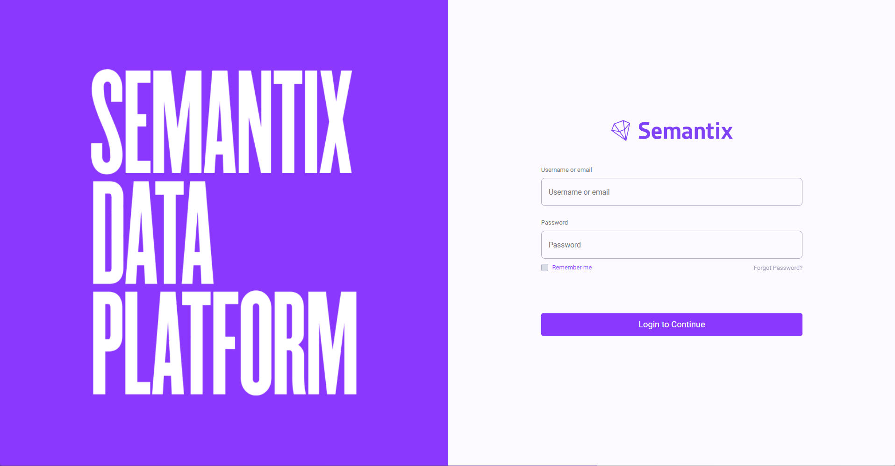
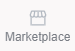

> :construction: Tutorial em construção :construction:

# **SDP Hands-on 1**: Pipeline e Connectors
## **Objetivo**: Uso prático do SDP para upload de uma base

### Acessar a Plataforma:
Para realizar esse tutorial, você precisa ter uma **conta de SDP**
Acesse o site [console.semantix.cloud](https://console.semantix.cloud/) para ter acesso a plataforma do SDP, digite o e-mail e senha enviados via *e-mail* OU CREDENCIAIS e click em "Login to Continue", como apresentada na imagem:

### Preparar os Dados:

Após logar na plataforma, o próximo passo é preparar os dados.....

### Ingerir os Dados:

## Criar Pipeline
# Create a Pipeline with a API Connector

Now, let's create a Pipeline that will extract the data from a API, in this example we will be using the Shopify API.

1-  You go to the pipelines using the sidebar and clicking the pipeline symbol: 

2-  Then click the "+New Pipeline" button, if you don't have a pipeline it will be in the middle of your screen, otherwise it will be in the top right:

3-  Choose your data source:

4-  After you chose the data source insert your credentials:

5-  Select the objects that you want to collect the data from and which table in the raw layer you want it to go to (output path):

6-  And then select your ingestion frequency preference, or customize it using a [cron expression](https://crontab.guru/):

and easy like that you have created your pipeline that is connected to the shopify API, now your data will be periodically ingested into the raw layer of the data lake. You can also manage and edit your pipeline if you want to, if you want to know how to do that, go to the ["Manage Your Pipeline"](/docs/pipeline/manage-pipeline) section

### Transformar os Dados:

Guia Jobs...

### Marketplace:
Uso do marketplace
Para acessar o Marketplace e carregar uma das bases disponíveis no ambiente do Data Lake da plataforma SDP.

Em seguida executaremos algumas transformações nos tipos de dados e carregaremos os dados até a base service para que os dados fiquem prontos para utilização na ferramenta de visualização de dados.

No menu lateral, vamos descer até Marketplace e clicar sobre esse ícone.

A lista de bases de dados disponíveis é apresentada. Podemos ver aqui que há bases com dados do IBGE, Banco Central, CNAE, ANS, Tesouro Nacional, Bolsa de Valores de São Paulo, Yahoo Finance, Receita Federal, Centro de Estudos Avançados em Economia Aplicada da Universidade de São Paulo, o CEPEA, além de bases com informações sobre investimentos.

Para esta demonstração, nós iremos utilizar a base do Yahoo Finance. Clique em “View More” para visualizar os detalhes sobre a base. Antes de fazermos a carga da base para o esquema Ró, o qual é o primeiro esquema no Data Lake para a inclusão dos dados, vamos verificar o descritivo sobre a base.

Trata-se de dados do Yahoo Finance que é um tipo de mídia que faz parte da rede do Yahoo. O Yahoo Finance fornece notícias, dados e comentários financeiros, incluindo cotações de ações, comunicados à imprensa, relatórios financeiros e conteúdo original. Ele também oferece algumas ferramentas online para gerenciar finanças pessoais.

Observando as informações disponíveis no dataset, podemos ver que se trata especificamente de dados de cotações do mercado de ações americano.

Podemos ver na lista de informações sobre o dataset que ele foi atualizado em 2023, contém uma série histórica desde 2000, o tamanho da base é de 1,5 Gigabyte, possui 12 colunas e 11.036.181 de registros sobre cotações.

Ao clicar em “Ticker – Sample” a plataforma fornecerá um arquivo CSV com uma amostra dos dados do dataset.

Ao abrir esse arquivo, podemos ver todos os atributos envolvidos e uma amostra de 5 registros do dataset.

Ao clicar em “Ticker – Data Dictionary” a plataforma fornecerá um arquivo Excel com o Dicionário de Dados do data set. Ao abrir esse arquivo, podemos ver os nomes dos atributos, os tipos de dados e a descrição de cada atributo, e se o atributo possui dicionário e se trata de dados sensíveis segundo a LGPD. Há ainda uma coluna com observação sobre o atributo.

Vamos fazer a cópia dos dados. O processo é muito simples e rápido. 

Para isto, basta clicar em “Add Base”.

Será apresentada uma caixa de diálogo pedindo a confirmação. Clique em “Load Base”.

Em poucos segundos a base será carregada no esquema Ró da plataforma e uma tela informando que o processo foi concluído com sucesso será exibida. 

Clique em “Go to Database”. A plataforme direcionará para o módulo “Visualize”.

Clique em “SQL Lab” e em seguida em “SQL Editor” para acessar o editor SQL e confirmar que os dados da base Yahoo Finance foram copiados. Para isto, no editor SQL, selecione o esquema Ró, clique no ícone ao lado do combo box com os nomes das tabelas para atualizar a lista e em seguida clique na seta da combo box e desça a lista até chegar no nome da tabela “marketplace_yahoo_finance_tickers” e clique sobre esse nome.

A relação de atributos aparecerá exatamente abaixo da combo box. Veremos que todos os atributos estão com tipo de dados “Varchar”.

Na guia “Results” veremos os dados da tabela.

Agora, iremos realizar a transformação dos dados, para deixar os atributos numéricos com os tipos corretos, e copiá-los para a camada service utilizando o módulo “Jobs”.

Clique em “Jobs” no menu lateral.

Clique em “New Job”. Nomeie o job como “Carga_Service_MKTP_Yahoo_Finance”.

No campo descrição, informe que é o job responsável por carregar e transformar os dados da base Yahoo Finance do esquema Ró para o esquema Service.

Clique em “Add”.
Na tela de criação de job, clique no sinal de “mais” e em “Scheduler”.

Altere o nome da trigger para “Agendamento” e clique em “1 minuto”. Assim, o job será executado a cada 1 minuto. Após a primeira execução, o job será desabilitado.

Clique em “Save”.

Clique no sinal de “mais” e em seguida em “SQL”.

Altere o nome do step para “Transforma_Copia_Schema_Service”.

Clique em “Open Editor” e insira os comandos para criar a tabela no esquema Service e copiar os dados transformados.

Clique em “Save”, em seguida em “Close Editor” e em “Apply”.
Verifique se o job está habilitado para ser executado.

Clique na guia “Logs” e verifique se o job foi executado com sucesso.
Desabilite o job.

Volte para ao “SQL Editor” no módulo “Visualize”.

Altere a seleção para o esquema “Service”, e atualize a lista de tabelas.

Selecione a tabela “Yahoo_Finance”.

Na guia “Results” veremos os dados transformados e na descrição da tabela. E logo abaixo da combo box, veremos os atributos com os tipos de dados ajustados.

Pronto! Os dados estão disponíveis para serem utilizados na ferramenta de visualização.

## Autor

| [ Rodrigo Augusto Rebouças](https://github.com/rodrigo-reboucas) | 
| :---: |
